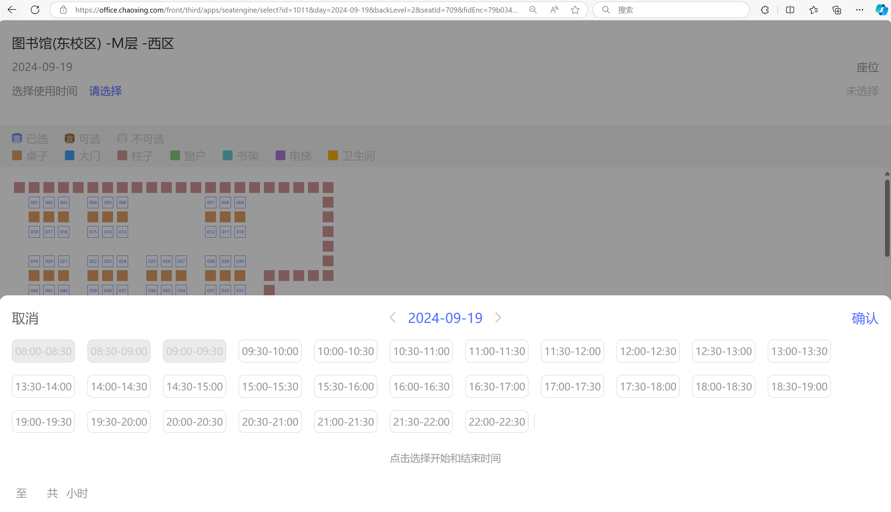

学习通抢座教程
安装说明
安装 Chrome 浏览器：确保你的系统中已安装 Chrome 浏览器。
适配 Selenium 版本：请确保使用的 Selenium 版本与 Chrome 浏览器兼容，否则无法正常驱动浏览器。
使用提示
在选择位置的标签时，如果代码中无法选中，请使用 F12 进行检查并进行相应调整。
视频教学
【三分钟实现学习通抢座教程】 https://www.bilibili.com/video/BV1KTsDeBEJZ/?share_source=copy_web&vd_source=042ef0773e848a5ea34c88628e1a559d

